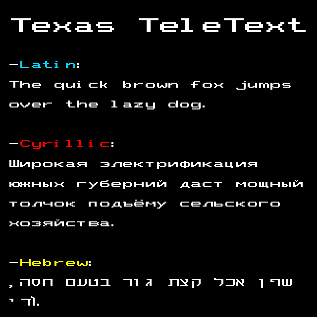

# Texas Teletext font replica
The font supports:
- Latin
- Basic Cyrillic
- Basic Hebrew 



You can see the full charset here:
```
!"#$%&'()*+,-.//0123456789:;<=>?@ABCDEFGHIJKLMNOPQRSTUVWXYZ[\\]^_`abcdefghijklmnopqrstuvwxyz{|}~¡¢£¤¥¦§¨©ª«¬®¯°±²³´µ¶·¹º»¼½¾¿ÀÁÂÃÄÅÆÇÈÉÊËÌÍÎÏÐÑÒÓÔÕÖ×ØÙÚÛÜÝÞßàáâãäåæçèéêëìíîïðñòóôõö÷øùúûüýþÿĀāĂ㥹ĆćĈĉĊċČčĎďĐđĒēĔĕĖėĘęĚěĜĝĞğĠġĢģĤĥĦħĨĩĪīĬĭĮįİıIJijĴĵĶķĸĹĺĻļĽľĿŀŁłŃńŅņŇňʼnŊŋŌōŎŏŐőŒœŔŕŖŗŘřŚśŜŝŞşŠšŢţŤťŦŧŨũŪūŬŭŮůŰűŲųŴŵŶŷŸŹźŻżŽž΄ΐΑΒΓΔΕΖΗΘΙΚΛΜΝΞΟΠΡΣΤΥΦΧΨΩΪΫάέήίΰαβγδεζηθικλμνοπρςστυφχψωϊϋόύώЁЄІЇЎАБВГДЕЖЗИЙКЛМНОПРСТУФХЦЧШЩЪЫЬЭЮЯабвгдежзийклмнопрстуфхцчшщъыьэюяёєіїўҐґאבגדהזחטיךכלםמןנסעףפץצקרשת—‖₪€₺←↑→■　
```